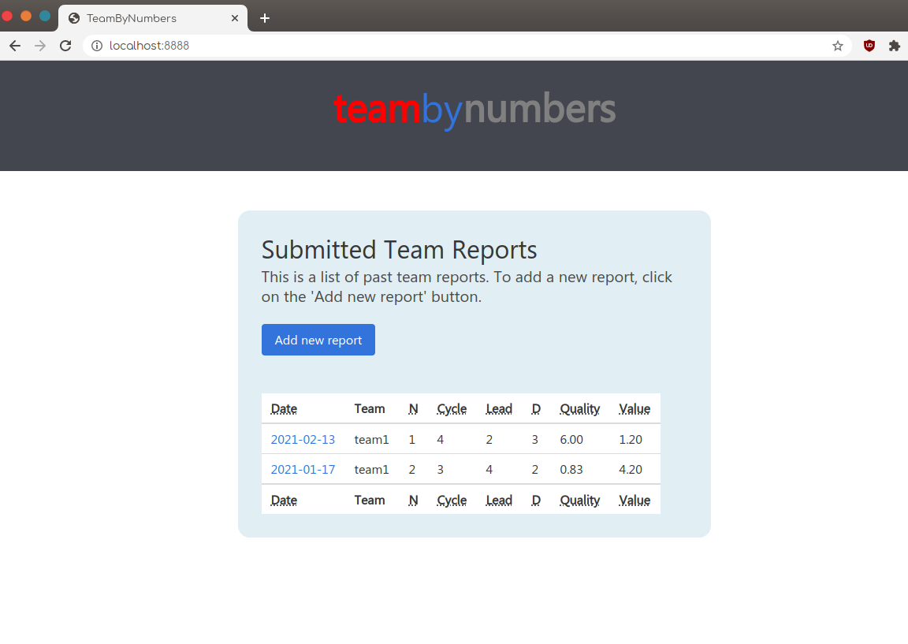
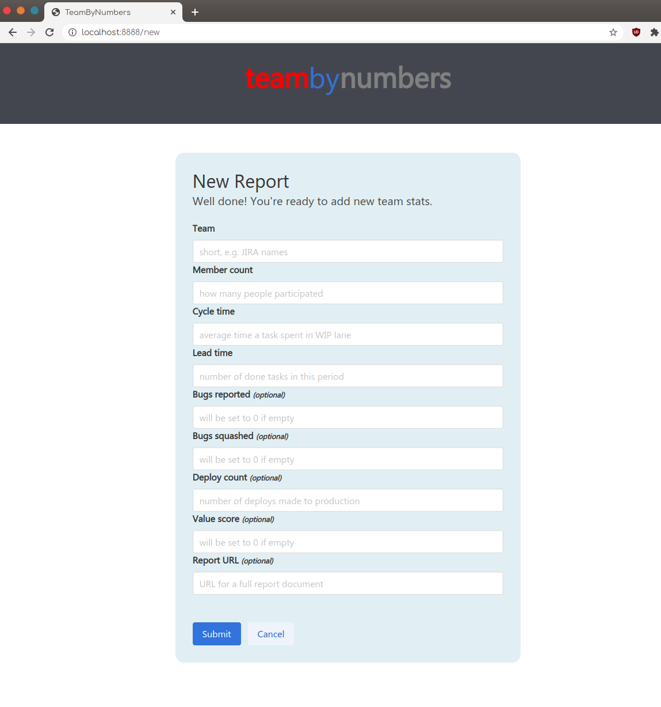

# teambynumbers

This is a tool I'm using to track my team. It uses CSV files for database and it's ment to be used with chart software (e.g. grafana) to plot the data.





## Setup
Create dummy database:

```bash
mkdir db
cp example.csv db/reports.csv
```

Compile (requires go1.15 or newer) and create a docker image:

```bash
./build.sh
```

Run with:

```bash
docker-compose up
```

You should now be able to visit http://localhost:8888

You can export data by accessing ``/api/v1/export``.
